# Shippr — SI vs Draft BL Verifier

[](https://github.com/Eishvar/monash-hackathon/actions/workflows/ci.yml)

**Inbox triage + Shipping Instruction (SI) vs draft Bill of Lading (BL) discrepancy checker** for shipping-documentation
teams. Built for the Averis x Monash Hackathon 2026 (Averis Shipping Documentation Services, RGE group).
<sub>Internal/package name `sdoc-verifier` (SDOC = Shipping DOCumentation); the product name is **Shippr**.</sub>

**Live app: https://monash-hackathon-five.vercel.app** · API docs: `/api/py/docs` · **[Technical documentation](docs/DOCUMENTATION.md)** · [Demo script and slides](docs/PRESENTATION.md)

## The problem

A shipping-documentation inbox mixes five kinds of email: requests to check a draft BL against the SI, new SI submissions,
invoice queries, operational noise and spam. Checking a BL means comparing seven fields by eye across PDF, Word, Excel and
text attachments, where the same field is labelled a dozen ways (`Load Port`, `POL`, `Port of Loading (POL)`). The data is
full of traps: subjects that mislead, attachments that are the wrong document, corrupt or scanned files, blank values.
A checker that cries wolf is worse than none: **false alarms cost points**.

## What it does

For every email it outputs one record: a **category**, and for BL comparisons a **status**
(`OK` / `MISMATCH` / `NEEDS_REVIEW`), the **exact set of differing fields**, and why it escalated when it will not guess.
The UI shows SI and BL values side by side (`SI: 3 / BL: 4`), or **"No mismatch detected."**, and lets a person
confirm or correct a value; the reviewer **sees the recomputed verdict before saving**, the status is recomputed by the same
deterministic code, and an audit row is written. Every email also records **how it was decided** (which stage ran, rule / AI /
code, how long). The inbox also has a search box (email ID, subject or sender).

Try it (2 minutes): open the inbox, filter **Status → Mismatch** and open `email_004` (the "How this was decided" stepper and the
side-by-side fields); open `email_001` for the all-clear case; open the **Review queue**, then `email_516` (a blank SI weight):
type a value and watch **Result after saving** change before you save; open `email_512` (a scanned PDF) to see AI-suggested
values; finish on **Metrics** (accuracy, discrepancies, cascade funnel, human in the loop).

## How it works

```mermaid
flowchart LR
    E[Email + attachments<br/>Supabase Postgres + Storage] --> P[Parse<br/>txt · docx · xlsx · pdf<br/>corrupt / scan detection]
    P --> C{Classify}
    C -- "rule fires" --> R[Rules]
    C -- "rules abstain" --> L[Text LLM<br/>OpenRouter]
    R --> X[Extract 7 fields<br/>label aliases]
    L --> X
    X -- "gap in a field" --> L2[LLM gap-fill<br/>evidence must be quoted]
    X -- "scanned PDF" --> V[Vision LLM<br/>OpenRouter]
    X --> N[Normalise + compare<br/>deterministic Python]
    L2 --> N
    N -- "near-identical values" --> A[LLM adjudicator<br/>can only clear a mismatch]
    N --> D[Decide status<br/>deterministic Python]
    A --> D
    V --> H
    D -- "OK / MISMATCH" --> O[Report + audit trail]
    D -- "unreadable / missing / wrong type / blank" --> H[Human review<br/>confirm or correct → recompute]
    H --> O
```



Plain text: `parse → classify (rules → LLM) → extract (rules → LLM → vision) → normalise/compare → decide → human review`.

**Principle: the LLM reads, code decides.** AI classifies ambiguous emails, extracts from messy or scanned documents,
adjudicates near-identical values and writes reviewer explanations. Normalisation and the final status are deterministic,
tested Python. The trust rules that make that safe:

- An LLM value may only **fill a field the rules left empty**, must **quote evidence found verbatim in the document**,
  and is never accepted for a placeholder (`____`, `N/A`, `TBA`), so genuine `missing_value` cases still escalate.
- The adjudicator is gated by typo-level similarity (≥ 0.95) and can only **clear** a mismatch, never create one.
- Explanations never change a status. Scanned documents stay `NEEDS_REVIEW / unreadable` and the vision model's values are
  *suggestions* for a human to confirm.
- Email bodies are untrusted input: every LLM answer is schema-validated JSON, and code, not the model, makes the decision.
- An LLM failure degrades to the rule result and is recorded (never silent); a failed email becomes a visible, retryable `ERROR`.

## Tech stack

| Layer | Technology | Used for |
|---|---|---|
| Frontend | Next.js 16, React 19, TypeScript, Tailwind CSS 4, shadcn/ui, lucide-react | Inbox, email report, review panel, review queue, process page, metrics, Gmail-style demo view |
| Backend | Python 3.12+, FastAPI, Pydantic | REST API (`api/index.py`) over the pure `sdoc/` pipeline package |
| AI / LLM | OpenRouter → Google Gemini 2.5 Flash (text + vision), one OpenAI-compatible client (`openai` SDK) | Classification fallback, field-gap extraction, scanned-document vision, mismatch adjudication, reviewer explanations. Model/provider are set in `.env`, never hardcoded |
| Document parsing | pdfplumber, pypdfium2, python-docx, openpyxl, Pillow | Read txt / PDF / Word / Excel attachments; render scanned PDFs to images for vision |
| Data & storage | Supabase (Postgres + private Storage) | `emails`, `results`, `reviews` (audit trail), `runs`, `llm_cache` tables; attachment files |
| Hosting / CI-CD | Vercel (Next.js + a Python serverless function), GitHub Actions | Every push runs pytest, ESLint, `tsc --noEmit` and `next build`, then deploys `main` automatically |
| Testing | pytest (171 tests), ESLint, TypeScript strict mode | Parsers, normalisers, decision logic, AI layer with fakes, stress tests, API tests, a held-out synthetic benchmark |

## Run it locally

Two paths: a **fast, no-account path** that runs the scoring pipeline against the local dataset (good for checking the
code works), and the **full app** with the database-backed UI (needs free Supabase + OpenRouter accounts). Commands below
are Windows PowerShell; macOS/Linux equivalents are noted where they differ.

### Prerequisites

- **Python 3.12 or newer** — `python --version`
- **Node.js 20 or newer** and npm — `node --version`
- **Git**
- Optional, only for the full app: a free **[Supabase](https://supabase.com)** project and a free **[OpenRouter](https://openrouter.ai/keys)** API key (a few cents of usage for the whole 520-email dataset)

### 1. Clone and install

```powershell
git clone https://github.com/Eishvar/monash-hackathon.git
cd monash-hackathon

python -m venv .venv
.venv\Scripts\Activate.ps1          # macOS/Linux: source .venv/bin/activate
pip install -r requirements-dev.txt  # FastAPI, pytest, and everything in requirements.txt

npm install                          # Next.js UI dependencies
```

### 2. Configure environment variables

```powershell
copy .env.example .env               # macOS/Linux: cp .env.example .env
```

Open `.env` and fill in what you have:

| Variable | Where to get it | Required for |
|---|---|---|
| `OPENROUTER_API_KEY` | [openrouter.ai/keys](https://openrouter.ai/keys) — create a key, add a few dollars of credit (the whole dataset costs cents) | The AI tier (classification fallback, extraction, vision, adjudication). Without it, everything runs **rules-only** and says so. |
| `SUPABASE_URL`, `SUPABASE_SERVICE_ROLE_KEY` | Supabase dashboard → your project → **Project Settings → API** (`URL` and the **service_role** secret key, not the anon key) | The cloud-backed app (`/api/py/*`, the Next.js UI, `scripts/seed_supabase.py`, `scripts/cloud_run.py`) |

You do **not** need any keys for step 3 below.

### 3. Fastest check: run the pipeline locally (no accounts needed)

```powershell
python scripts/run_pipeline.py --no-llm   # rules only, no keys needed -> outputs/submission.json
python scripts/score.py                   # scores it against the organiser's answer key -> prints 1.0000 (this dataset is rule-friendly)
pytest -q                                 # 171 tests, no keys needed, ~15s
```

If you added `OPENROUTER_API_KEY`, drop `--no-llm` to also exercise the AI tier:

```powershell
python scripts/run_pipeline.py            # rules -> LLM fallback -> vision, -> outputs/submission.json
python scripts/score.py                   # should print 1.0000
python scripts/benchmark.py               # held-out synthetic benchmark (rules only by default, seconds)
```

### 4. Full app: cloud-backed UI on your machine

Needs the Supabase keys from step 2.

```powershell
# One-time: open the Supabase SQL editor (dashboard -> SQL Editor -> New query),
# paste the contents of supabase/schema.sql, and click Run. This creates the tables,
# storage bucket and row-level security policies.

python scripts/seed_supabase.py           # uploads the 520 sample emails + attachments, warms the LLM cache

uvicorn api.index:app --reload --port 8000   # terminal 1: the FastAPI backend
npm run dev                                   # terminal 2: the Next.js UI on http://localhost:3000
```

Open **http://localhost:3000** — the UI calls `/api/py/*`, which Next.js proxies to `localhost:8000` in dev
(`next.config.ts`; in production, `vercel.json` routes it to the same serverless function instead).

Optional: `python scripts/cloud_run.py` drives the **deployed** Vercel API end-to-end and re-exports/scores from the
live database; `python scripts/evaluate.py` writes an ablation + unseen-phrasing accuracy report to `outputs/metrics.json`.

### Swapping the AI model

No code changes needed: set `LLM_TEXT_MODEL`, `LLM_VISION_MODEL` (or a per-task override, e.g. `LLM_MODEL_CLASSIFY`) in
`.env`. Defaults live in one place, `sdoc/config.py` (`DEFAULT_MODELS`). See the comments in `.env.example`.

### Troubleshooting

- **`Activate.ps1` is blocked by execution policy** — run PowerShell as your user and execute
  `Set-ExecutionPolicy -Scope CurrentUser RemoteSigned`, then retry.
- **Port 3000 or 8000 already in use** — stop the other process, or pass `--port` to `uvicorn` and change the proxy
  target in `next.config.ts` to match.
- **`/api/py/health` reports a setting as `false`** — that env var isn't loaded; confirm `.env` is in the repo root and
  restart both `uvicorn` and `npm run dev` (env files are only read at process start).
- **Rules-only vs full AI** — `run_pipeline.py`/the app never crash without `OPENROUTER_API_KEY`; they just skip the AI
  tier and report a lower rule share. Add the key and re-run to see the AI steps.

## Results

Scored with the organiser's scorer (aggregate output only; the answer key is never read). The final row was reproduced
**in the cloud**: all 520 emails reprocessed on Vercel + Supabase and exported from the database.

| When | Change | Final score | End-to-end | Escalations | Decided by rules |
|---|---|---|---|---|---|
| start | sample submission (everything "GENERAL") | 0.012 | 0/46 | 0/20 | – |
| M1 | parsers + rules, no AI | 0.940 | 45/46 | 19/20 | 100% |
| M1 | classifier + placeholder + PDF fixes | **1.000** | 46/46 | 20/20 | 100% |
| M2 | + LLM tier (text, vision, adjudicator) | **1.000** | 46/46 | 20/20 | 88% |
| M4 | processed **in the cloud** (Vercel + Supabase), exported from the database | **1.000** | 46/46 | 20/20 | 88% |
| final | reprocessed in the cloud with the decision trace enabled (821 s, 0 errors, about $0.03 cold) | **1.000** | 46/46 | 20/20 | 88% |

- **Honest caveat.** The provided dataset is friendly to rules (rules alone also score 1.000), and the rules and prompts were
  tuned on it, one finding (`send me the draft BL` is a BL_COMPARISON) from the scorer's aggregate output
  ([decision D8](docs/DECISIONS.md)). A perfect local score is not a promise about hidden data.
- **So we measure generalisation separately.** 36 hand-written emails in different wording (none from the dataset):
  classification accuracy **67% with rules only → 100% with rules + LLM**. A test also asserts that a rule never fires wrongly
  on that set: rules abstain rather than guess, and the LLM covers the rest.
- **Held-out benchmark with known answers** (`python scripts/benchmark.py`). 500 random SI/BL pairs generated by
  `sdoc/synth.py` in txt, docx, xlsx and pdf with three label vocabularies: equivalent formatting (`LIMITED` = `LTD`,
  `22 MT` = `22,000 KG`), planted defects, one-word near-miss names, blanks, wrong documents, missing and corrupt files.
  Result: **0.0% false alarms**, 99.8% exact match, defect precision 0.997 / recall 1.000, escalation precision and recall 1.0.
  The one miss is a real limit we did not hide: tonne values with decimals can differ by float rounding (`16.1 MT` vs
  `16,100 KG`); the fix is a tolerance in `sdoc/normalize.py`.
- **Robustness tests.** The same generators back the pytest stress tests: identical content is never flagged; changing one
  field flags exactly that field; blanks and wrong document types escalate.
- **Cost and speed.** 88% of emails are decided by rules with no AI call. Every LLM response is cached by content hash
  (disk + a `llm_cache` table), so a repeat run makes **0 LLM calls** (520 emails in about 3.5 s locally). The cloud run's 6 cold
  vision calls cost ≈ **$0.009**. Cloud batches of 15 emails take 12-50 s (database round-trips); a full cloud reprocess of
  520 emails takes about 14 minutes.
- **171 automated tests** run in CI on every push (Python 3.12) alongside the frontend's lint, type-check and build.

## Requirements map

| Requirement | Where it is |
|---|---|
| **AI in core functionality** | Email classification fallback, field extraction fallback, vision extraction for scans, mismatch adjudication, reviewer explanations (`sdoc/llm.py`, `classify.py`, `extract.py`, `adjudicate.py`, `explain.py`). Models are swappable through `.env`. |
| **Cloud infrastructure** | Pipeline runs as a **Vercel Python function** (FastAPI); emails, attachments, results, review audit trail and LLM cache live in **Supabase** (Postgres + private Storage); inference via OpenRouter (Gemini 2.5 Flash); GitHub → Vercel deploys on every push. |
| Architecture and decisions | [docs/ARCHITECTURE.md](docs/ARCHITECTURE.md), [docs/DECISIONS.md](docs/DECISIONS.md) (22 short records) |
| Validation | Score log above, held-out benchmark, `scripts/evaluate.py` (ablation + unseen phrasings), 171 tests, `/metrics` page |
| Practical value | REST API an RPA bot or SAP could call, audit trail, human-in-the-loop review, cost metrics |

## API (`/api/py`, interactive docs at `/api/py/docs`)

| Method | Path | Purpose |
|---|---|---|
| GET | `/health` | Liveness and which settings are configured (booleans only) |
| GET | `/emails?category&status&limit&offset&q` | Inbox with each email's result; `q` searches ID, subject, sender |
| GET | `/emails/{id}` | Email, result (side-by-side fields, explanation, notes), audit trail |
| POST | `/process/{id}` | Process or retry one email |
| POST | `/process-batch` | Process a small batch (≤ 50) inside the serverless time budget |
| GET | `/review-queue` | Cases waiting for a person |
| POST | `/reviews/{id}` | `confirm` / `correct` values → status recomputed + audit row |
| POST | `/reviews/{id}/preview` | Dry run: the verdict the corrections would produce (writes nothing) |
| GET | `/metrics/reviews` | Human-in-the-loop counts, verdict changes, recent reviews |
| GET | `/metrics/pipeline` | Cascade funnel (rules / AI / vision / human) and per-stage latency |
| GET | `/export/csv` | Mismatches and escalations as a spreadsheet |
| GET | `/export/submission` | Every email in the scorer's exact JSON shape |
| GET | `/metrics` | Counts, rule share, LLM calls, tokens, estimated cost |

## Limits and roadmap

- Known limit: tonne values with decimals can differ by float rounding (see Results); the fix is a comparison tolerance.
- **The API is unauthenticated** (a deliberate demo trade-off). Roadmap: a shared-key header on write routes, then real
  authentication with per-team access. Request sizes are already capped, and repeat calls hit the cache.
- No attachment preview in the UI yet (needs signed Storage URLs). Values come from the parsed documents.
- OCR on scans is imperfect (`STATIONERYLLC`), which is why scans always go to a human. Roadmap: field-level confidence and
  highlighting the region on the page.
- Cloud throughput is bounded by per-email database round-trips and LLM rate limits; a queue and batch writes would
  remove both. Single-tenant data model.
- Integrations: an inbound webhook so an RPA bot or SAP can push new emails, and a write-back of the verdict to the mailbox.

## Repository layout

```
api/index.py     FastAPI routes (thin), deployed as a Vercel Python function
sdoc/            pipeline: config, llm, parse/, classify, extract, normalize, compare, decide, adjudicate,
                 explain, pipeline, trace, synth, service, db, store, metrics
src/             Next.js 16 UI: inbox, email report, review panel, review queue, process, metrics, Gmail-style demo view
supabase/        schema.sql (tables, RLS on, private bucket created by the seed script)
scripts/         run_pipeline, score, evaluate, benchmark, seed_supabase, cloud_run, eval_extraction
tests/           pytest: parsers, normalisers, compare/decide, AI layer with fakes, stress, API, unseen phrasings
docs/            DOCUMENTATION, PRESENTATION, ARCHITECTURE, DECISIONS, SPEC, DATA_NOTES, RUBRIC, PLAN, DEMO
```

Built in two days with Claude Code (plan-first milestones, documented in `docs/PLAN.md`).
