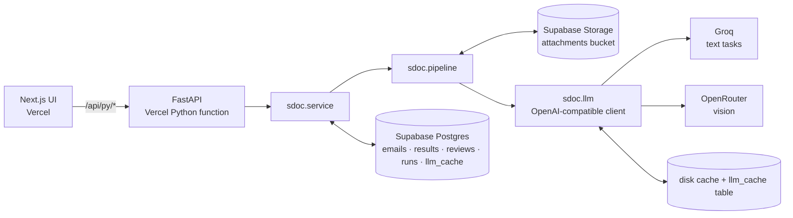

# Architecture

## Flow

Local path (fast iteration): `scripts/run_pipeline.py` runs the same `sdoc/` code over the bundle and writes
`outputs/submission.json`; `scripts/score.py` scores it. The cloud path (`scripts/cloud_run.py`) drives the deployed API.

## Pipeline stages (all in `sdoc/`)
1. **Parse** (`parse/readers.py`, `parse/labels.py`, `parse/render.py`): file → `Doc{kind, 7 raw fields, text, unreadable, scanned}`.
   Every format yields (label, value) pairs; labels align to fields by meaning (`ALIASES`); PDFs are read as words in stream
   order (a wrapped label can overlap its value column, D9), container tables are counted and summed. Corrupt files and
   image-only PDFs are detected, never raised.
2. **Classify** (`classify.py`): rules over the body's opening text and attachment names, not the subject. A rule that fires is
   final; when none does (`matched=False`) the text LLM classifies (`decided_by="llm"`). "Send me the draft BL" is a
   BL_COMPARISON with nothing to compare (D8).
3. **Extract** (`extract.py`): rules first. A field left empty gets an LLM gap-fill that must quote evidence present in the
   source; scanned PDFs are rendered to PNG and read by the vision model, values kept as suggestions (D13).
4. **Compare** (`normalize.py`, `compare.py`, `adjudicate.py`): per-field normalisers (party name/address, port name, container
   count, weight incl. tonnes) then exact comparison on normalised values (D10). Near-identical pairs (similarity ≥ 0.95) may be
   sent to the LLM adjudicator, which can only clear a mismatch.
5. **Decide** (`decide.py`): precedence `missing_attachment > unreadable > wrong_doc_type > missing_value`, else `OK` or
   `MISMATCH` with the exact `defect_fields`. Pure function, no LLM.
6. **Explain** (`explain.py`): 1–2 sentence reviewer text for MISMATCH/NEEDS_REVIEW; never changes status.
7. **Human review** (`service.review`): a person confirms or corrects values → `decide()` recomputes → result updated and a
   `reviews` audit row written (before/after).

Cross-cutting: `llm.py` is the only module that talks to a provider (JSON schema validation, one repair retry, retry with the
provider's `retry-after`, per-task token caps, content-hash cache). `config.py` holds the only default model names; `.env`
overrides per role or task (D11).

## Application layer
- `service.py`: process one/batch (time-budgeted for serverless), review + recompute, export in the scorer's shape, metrics.
  Failures become a persisted `ERROR` row (visible, retryable).
- `db.py`: `Repository` protocol with `SupabaseRepo` and an in-memory fake; `SupabaseHandle` gives each thread its own client
  because the HTTP/2 connection is not thread-safe (D17). `store.py`: `AttachmentStore` (local bundle / Supabase Storage).
- `api/index.py`: thin FastAPI routes under `/api/py`, request-size caps; `vercel.json` rewrites `/api/py/*` to the function (D7).
- `src/`: Next.js 16 client components calling the API: inbox, email report (side-by-side SI vs BL), review panel,
  review queue, process, metrics (D16).

## Data model (Supabase, `supabase/schema.sql`, RLS on with no policies: only the backend's service key)
- `emails` (email_id, sender, subject, body, attachments jsonb)
- `results` (email_id PK; category, status, review_reason, has_defect, defect_fields, decided_by; `fields` and
  `provisional_fields` jsonb; explanation; notes; processing_error; reviewed; run_id; updated_at)
- `reviews` (id, email_id, action confirm|correct, before, after, note, created_at) — audit trail
- `runs` (id, models, stats, score) · `llm_cache` (key, response)
- Storage: private `attachments` bucket, same relative paths as the bundle.

## API (`/api/py`)
`GET /health` · `GET /emails?category&status&limit&offset` · `GET /emails/{id}` · `POST /process/{id}` ·
`POST /process-batch` · `GET /review-queue` · `POST /reviews/{id}` · `GET /export/submission` · `GET /metrics`
