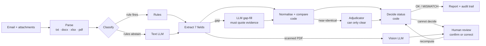

# Shippr: technical documentation

Shippr (repo name: SDOC Verifier) triages a shipping-documentation inbox and checks a Shipping Instruction (SI) against a
draft Bill of Lading (BL) field by field. Built for the Averis x Monash Hackathon 2026.

- Live prototype: https://monash-hackathon-five.vercel.app (API docs at `/api/py/docs`)
- Source and setup: [README](../README.md) · Decision log: [DECISIONS.md](DECISIONS.md) · Detailed module notes: [ARCHITECTURE.md](ARCHITECTURE.md)

## 1. Problem and users

A documentation team's inbox mixes five kinds of email: requests to check a draft BL, new SI submissions, invoice queries,
operational noise and spam. Checking a BL means comparing seven fields (`shipper, consignee, notify_party, port_of_loading,
port_of_discharge, container_count, gross_weight_kg`) by eye across PDF, Word, Excel and text attachments. The same field is
labelled a dozen ways, subjects mislead, attachments are sometimes the wrong document, corrupt, scanned or blank. A checker that
raises false alarms is worse than none, so the design goal is: **find every real discrepancy, raise no false ones, and hand
anything uncertain to a person.**

## 2. Architecture

**Principle: the LLM reads, code decides.** AI is used to read messy input (classify ambiguous emails, extract from unusual
layouts, read scans), to judge near-identical values, and to write reviewer explanations. Normalisation, comparison and the
final status are deterministic, unit-tested Python, so the AI cannot invent a mismatch.

### Deployment

| Layer | Technology | Role |
|---|---|---|
| UI | Next.js 16, React 19, TypeScript, Tailwind CSS 4 | Inbox, report, review queue, process, metrics, Gmail-style demo view |
| API | FastAPI (Python 3.12) as a Vercel Python function | Thin routes under `/api/py/*`; all logic in the `sdoc/` package |
| Data | Supabase Postgres + private Storage | `emails`, `results`, `reviews` (audit), `runs`, `llm_cache`; attachments |
| AI | OpenRouter, Gemini 2.5 Flash (text and vision) through one OpenAI-compatible client | Models swapped in `.env`, never in code |
| Documents | pdfplumber, pypdfium2, python-docx, openpyxl, Pillow | Parse four formats, render scans for vision |
| Delivery | GitHub Actions + Vercel | Every push runs pytest, lint, type-check and build, then deploys |

### The cascade in detail

1. **Parse** turns each file into seven raw fields plus a `kind` (SI / BL / other). Every format yields (label, value) pairs and
   labels are aligned to fields by meaning. Corrupt files and image-only PDFs are detected and never raise.
2. **Classify** uses rules on the email body and attachment names (not the subject). If no rule fires, the text LLM classifies.
3. **Extract**: rules first. A field the rules left empty may be filled by the LLM only if it quotes evidence found verbatim in
   the document and the value is not a placeholder (`____`, `N/A`, `TBA`). Scanned PDFs are rendered to images and read by the
   vision model; those values stay suggestions.
4. **Compare** on normalised values: party names ignore case, punctuation and `LIMITED`/`LTD`; ports drop LOCODE and country;
   counts read `Six (6) x 40'HC`; weights understand `22 MT` = `22,000 KG`.
5. **Adjudicate**: only near-identical mismatches (typo-level similarity ≥ 0.95) go to an LLM, which can only **clear** them.
6. **Decide**: pure function with a fixed precedence (`missing_attachment` > `unreadable` > `wrong_doc_type` > `missing_value`),
   else `OK` or `MISMATCH` with the exact set of differing fields.
7. **Explain**: a one or two sentence reviewer summary. It never changes a status.
8. **Human review**: a person confirms or corrects values. A dry-run endpoint shows the recomputed verdict before saving; saving
   recomputes with the same `decide()` and writes an audit row (before / after / note).

### Decision trace

Every result stores the stages that ran, the method (rule / AI / code), the duration and details (e.g. `7/7 fields`, `cached`).
The email page shows it as "How this was decided"; the metrics page aggregates stage latency and the method mix.

## 3. Implementation highlights

- **One LLM client** (`sdoc/llm.py`): provider and model per task from `.env`, Pydantic-validated JSON with one repair retry,
  retry with backoff, token caps, and a content-hash cache on disk and in a `llm_cache` table. A repeat run makes 0 LLM calls.
- **Failures are visible.** An LLM failure degrades to the rule result and is recorded in the notes; a failed email becomes a
  retryable `ERROR` row, never a silent default. A missing database column cannot break processing (the trace write falls back).
- **Repository and store interfaces** (`Repository`, `AttachmentStore`) with Supabase and in-memory implementations, so the same
  service code runs in the cloud and in tests. One Supabase client per thread (the HTTP/2 connection is not thread-safe).
- **Serverless-aware processing**: batches are time-budgeted to fit the function limit; the Process page drives them.
- **Security posture**: keys only in server environment variables; row-level security on with no public policies; private
  bucket; request sizes capped; email bodies treated as untrusted input.
- **REST API** for integration: `/emails`, `/emails/{id}`, `/process/{id}`, `/process-batch`, `/review-queue`, `/reviews/{id}`,
  `/reviews/{id}/preview`, `/export/submission`, `/export/csv`, `/metrics`, `/metrics/reviews`, `/metrics/pipeline`.

## 4. Validation: measured, not claimed

| Test | Result |
|---|---|
| Organiser's scorer, 520 emails, processed in the cloud and exported from the database | **1.0000** (46/46 defects caught end to end, 20/20 escalations, classification macro-F1 1.000) |
| Held-out synthetic benchmark (`scripts/benchmark.py`): 500 SI/BL pairs with known answers, 4 formats (txt, docx, xlsx, pdf), 3 label vocabularies, equivalent-format variants, planted defects, near-miss names, blanks, wrong documents, missing and corrupt files | **0.0% false alarms**, 99.8% exact match, defect precision 0.997 / recall 1.000, escalation precision and recall 1.0 |
| Unseen email wording (36 hand-written emails) | classification **67% rules only → 100% rules + AI** |
| Cost and speed | 88% of emails decided by rules with no AI call; whole-dataset cloud run ≈ $0.03 cold, $0 when cached |
| Automated tests | 171 tests in CI on every push |

**Honest caveats.** The provided dataset is friendly to rules (rules alone score 1.000) and the rules were tuned on it, which is
why the benchmark and the unseen-wording set exist. The benchmark found one real limit: tonne values with decimals can differ
from the kilogram value by float rounding (`16.1 MT` vs `16,100 KG`), a false alarm. The fix is a tolerance in `normalize.py`.

## 5. Challenges and how we handled them

| Challenge | What we did |
|---|---|
| Misleading subjects and wrong attachments | Classify on body and attachment names; detect the document type from its content and escalate `wrong_doc_type` |
| The same field under a dozen labels | Label alias table plus an LLM gap-fill that must quote evidence |
| PDF layout (wrapped labels overlapping values) | Read PDF words in stream order instead of `extract_text()` |
| Scans and OCR errors | Never auto-trust: vision AI pre-fills, a person confirms |
| Avoiding false alarms | Deterministic comparison on normalised values; the AI can only clear a mismatch, never create one |
| A dataset that is too easy | Separate held-out benchmark and unseen-wording set; we report what is tuned and what is measured |
| Serverless limits and free-tier rate limits | Time-budgeted batches, content-hash cache, one model provider |
| Trust in an AI system | Audit trail, decision trace, human-verified state, dry-run preview before saving |

## 6. Roadmap

- **Security**: a shared-key header on write routes, then real authentication and per-team access.
- **Reviewer experience**: attachment preview with the source region highlighted, field-level confidence.
- **Scale**: a queue and batch database writes for higher throughput; multi-tenant data model.
- **Integration**: inbound webhook so an RPA bot or SAP pushes new emails, and write-back of the verdict to the mailbox.
- **Accuracy**: tolerance-based weight comparison; more label vocabularies and document layouts in the benchmark.
- **Learning loop**: use reviewer corrections as new labelled examples for the rules and the benchmark.
